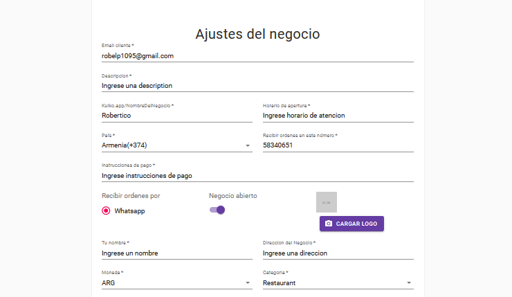
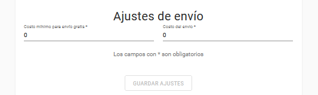

# Ajustes del negocio

---

### Así es como se configura su negocio

Aquí lo completarás
  1. **Email cliente:** Debe insertar su email.
  2. **Descripción:** ¿Qué hace tu negocio? por ejemplo, vendemos increíbles juguetes hechos a mano (esto también se usa para SEO y meta descripción cuando comparte su tienda con sus amigos, familiares y clientes)..
  3. **Kulko.app/NombreDelNegocio:** Su marca, por ejemplo, Mi tienda de accesorios.
  4. **Horario de apertura:** El horario de apertura de su negocio.
  5. **País:** Seleccione el país correcto ya que esto agregará el código de país a su número de WhatsApp.
  6. **Recibir órdenes en este número:** Complete esto con el número activo de su WhatsApp.
  7. **Instrucciones de pago:** Aquí es donde instruye a su cliente sobre las opciones de pago.
  8. **Recibir órdenes por:** marque si desea recibir órdenes por whatsapp.
  9. **Negocio abierto:** Encienda / apague según su conveniencia para recibir o pausar la toma de pedidos.
  10. **Logo:** Cada tienda / marca tiene una identidad, no dude en subir su logotipo. Si no tiene uno, busque un creador de logotipos gratuito en Google y cree uno que se adapte a su marca.
  11. **Tu nombre** Su nombre debe completarse aquí.
  10. **Direción del negocio:** Esta es la ubicación de su tienda / negocio. Siéntase libre de ingresar la dirección de su casa en caso de que esté operando desde casa..
  11. **Moneda:** Esta es su moneda local o una internacional que funcione para su negocio, esta es la que aparecerá en la página de su tienda.
  12. **Categoría:** Seleccione el tipo de su negocio de la lista desplegable.
  
  ---
### Ajustes de envío

  1. **Costo mínimo para envío gratis:** Complete la cantidad por encima de la cual ofrecerá envío GRATUITO.
  2. **Costo de envío:** Defina el costo del envío.
  
#### Eso es todo en Configuración, a continuación, le mostraremos Categorías y Productos