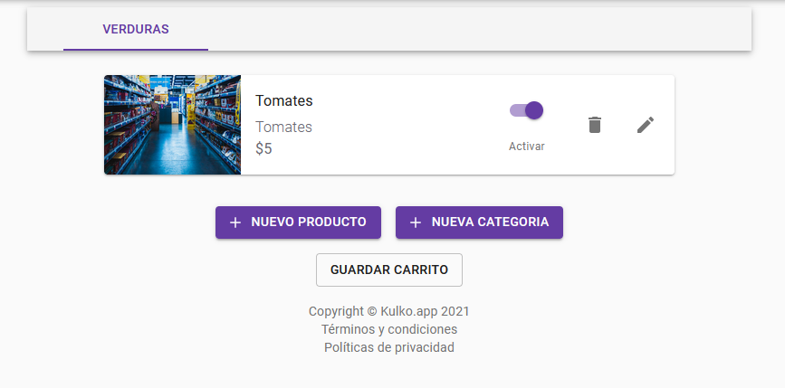
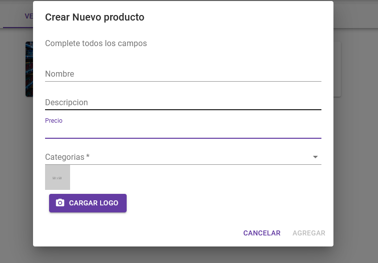

# Administrar catálogo

### Agregar su catálogo de productos
---

1. **Activar:** Si se queda sin este producto, no dude en apagarlo, no se mostrará en la página de su tienda.
3. **Editar:** Dirije a una vista para editar el producto.
4. **Nuevo producto:** Dirije a una vista para crear un producto.
5. **Nueva categoría:** Dirije a una vista para crear una categoía.

---

### Editar

1. **Nombre:** El nombre del producto.
2. **Descripcíon:** Una descripción del producto.
3. **Precio:** El precio del producto.
4. **Categoría:** La categoría del producto.
5. **Cargar logo:** Un logo que describa el producto.
6. **Cancelar:** Cancela la creación del producto.
7. **Actualizar** Actualiza los datos del producto.

---

### Nuevo Producto

1. **Nombre:** El nombre del producto.
2. **Descripcíon:** Una descripción del producto.
3. **Precio:** El precio del producto.
4. **Categoría:** La categoría del producto.
5. **Cargar logo:** Un logo que describa el producto.
6. **Cancelar:** Cancela la creación del producto.
7. **Agregar:** Agrega el producto.

---

### Nueva categoría

1. **Nueva Categoría:** El nombre de la categoría.
2. **Cancelar:** Cancela la creación de la categoría.
3. **Agragar:** Agrega la categoría.

---
¡Finalmente, presione **GUARDAR CARRITO**! Ahora está listo para una [vista previa de su negocio en Kulko](../Adelanto)
